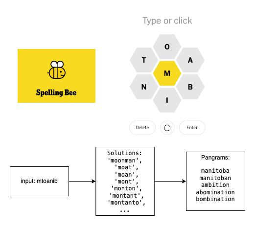
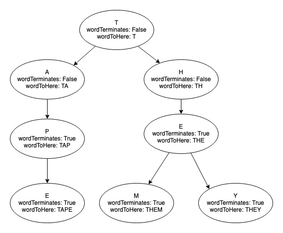

# Spelling Bee Solver

 

## What is this?

This is a solver for the New York Times Spelling Bee puzzle. 

There were two goals to this:

1. Efficiently identify possible solutions to a Spelling Bee puzzle 
2. As a subset to the above, identify the pangrams, words that use all of the puzzle letters.

## App

There is a [Shiny App hosted on ShinyApp.io](https://kennethjmyers.shinyapps.io/spellingbeesolver/) that you can use to run the app. It is hosted on a free tier and it turns off if it has been idle for 15 minutes. You may need to wait a minute while the app restarts.

You can also run the solver through the [SolverUI.ipynb](./SolverUI.ipynb) notebook which is hosted on [Binder](https://mybinder.org/v2/gh/kennethjmyers/SpellingBeeSolver/main?labpath=SolverUI.ipynb).

## How it works

The dictionary is broken down into 26 separate trees for each starting letter of a word. Each node in the tree represents an ordered lettering for a word. A simple example is below:

In the dictionaries, words with fewer than 4 letters are ignored and so "The" and "Tap" would actually not be marked as terminating words and would be excluded from the final solution. 

Each puzzle has 7 letters and the solver looks for the 7 trees corresponding to these letters. It then performs a depth-first-search on these 7 trees *for words made up of only these letters*, ignoring paths with non-puzzle letters, and returns only words that have the center letter.

It then subsets these down to the pangrams by finding a matching set of letters between the puzzle and the solutions.

## Caveats 

The New York Times Spelling Bee's answer words are [chosen by moderators](https://www.nytimes.com/2020/10/16/crosswords/spellingbee-puzzles.html). The words include those that can be found in dictionaries like Merriam Webster but [they can also include words not found in common dictionaries](https://spellingbeetimes.com/2020/11/26/what-dictionary-does-nyt-spelling-bee-use/) (this site has a quote that is no longer on the NYT website). As such this solver can miss uncommon words.

This project uses the words_alpha.txt dictionary from [dwyl/english-words](https://github.com/dwyl/english-words) and the original copyright belongs to [infochimps](https://web.archive.org/web/20131118073324/https://www.infochimps.com/datasets/word-list-350000-simple-english-words-excel-readable) (archived). This dataset is a bit old, at least from 2013 at the time of archival and thus is more likely to be missing newer words.
